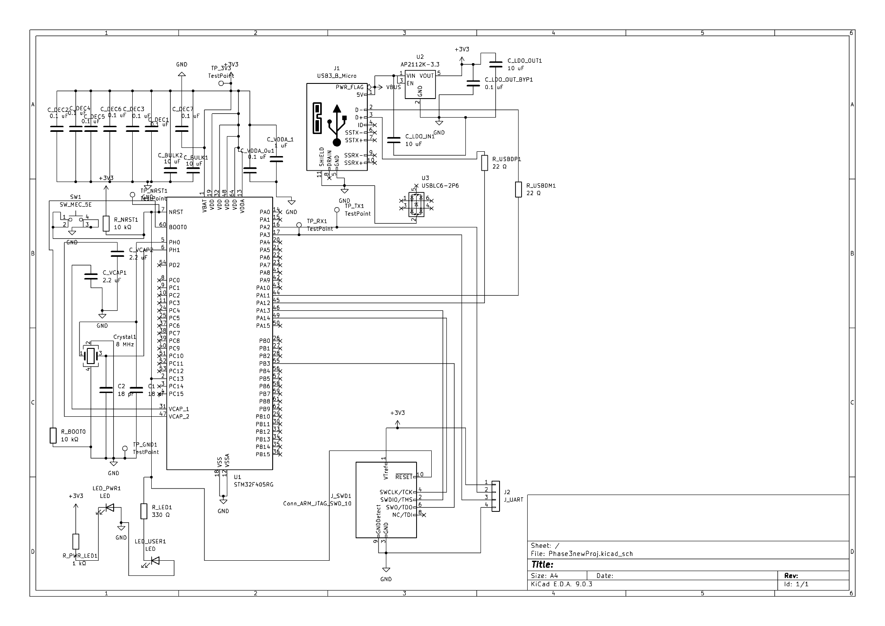

# Bring-up Notes

## 1. Hardware Assumptions
- Supply Voltage (VDD): **3.3 V**
- Crystal Frequency: **8 MHz** (for system clock input)
- Debug Interface: **SWD** (PA13 = SWDIO, PA14 = SWCLK)
- USB Interface: **Full-Speed USB (PA11 = D-, PA12 = D+)**
- UART: **PA9 (TX), PA10 (RX)** for serial bring-up
- Power Regulator: **AP2112K-3.3** (5V → 3.3V)

---

## 2. Component Selection Reasoning
- **MCU (STM32F405RG)**: Cortex-M4, widely supported, sufficient flash/RAM for firmware bring-up.
- **Crystal (8 MHz)**: Provides stable system clock source with external capacitors for stability.
- **AP2112K-3.3 Regulator**: Low dropout, provides clean 3.3V for MCU and peripherals.
- **USB ESD Protection (USBLC6-2P6)**: Ensures safe USB operation against surges/ESD.
- **Reset Circuit**: Tactile switch + pull-up resistor for manual reset.
- **LEDs**:
  - **Power LED (PB1)**: Indicates board is powered.
  - **User LED (PB0)**: For firmware-controlled status/debug.
- **UART Header (J2)**: Provides bring-up communication via PA9/PA10.

---

## 3. Final Pinout Diagram

### Diagram

### Pin Usage Table

| Pin        | Function on Board       | Notes                                |
|------------|-------------------------|--------------------------------------|
| VDD/VDDA   | +3.3V                   | Decoupling capacitors placed nearby  |
| VSS/VSSA   | GND                     | Common ground                        |
| NRST       | Reset Button            | Pull-up resistor + tactile switch    |
| BOOT0      | Boot config jumper      | Default pulled low (10 kΩ)           |
| PC14/PC15  | 8 MHz Crystal           | With load capacitors                 |
| PA9/PA10   | UART Tx/Rx              | External UART header                 |
| PA11/PA12  | USB D- / D+             | With 22 Ω resistors                  |
| PA13/PA14  | SWDIO / SWCLK           | Debug connector (SWD)                |
| PB0        | LED (User, Green)       | Firmware controlled                  |
| PB1        | LED (Power, Red)        | Indicates power good                 |

---

## 4. Bring-up Checklist
1. **Power**
   - Verify regulator output = 3.3V.
   - Check Power LED (PB1) is ON.
2. **Reset**
   - Press NRST, ensure MCU resets cleanly.
   - Confirm boot mode (BOOT0 = low → flash boot).
3. **UART**
   - Connect USB-UART adapter to PA9/PA10.
   - Send/receive test message at **115200 baud**.
4. **SWD Debug**
   - Connect programmer to PA13/PA14.
   - Flash a simple LED blink firmware.
5. **USB (Optional Bring-up)**
   - Connect USB Micro-B.
   - Verify device enumerates on host PC.

---

## 5. Routing & Layout Notes
- **Decoupling Capacitors**: Each VDD pin has a 0.1 µF capacitor placed close to the MCU.
- **Bulk Capacitors**: 10 µF capacitors near regulator output and USB power.
- **Crystal Capacitors**: 18 pF load caps placed symmetrically and close to MCU pins.
- **Reference Voltage (VDDA)**: Proper filtering capacitor to reduce noise.
- **USB Data Lines**: Differential pair routed together with controlled impedance.
- **Test Points**: Added for UART (TX, RX, GND) and power rails for easy debugging.

---

📌 With this checklist and documentation, the board should be ready for first power-on and debug.
